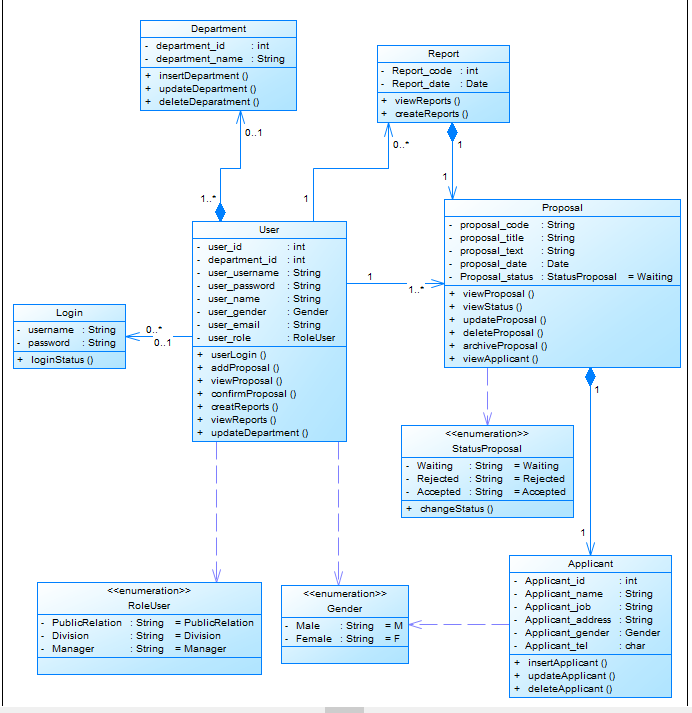
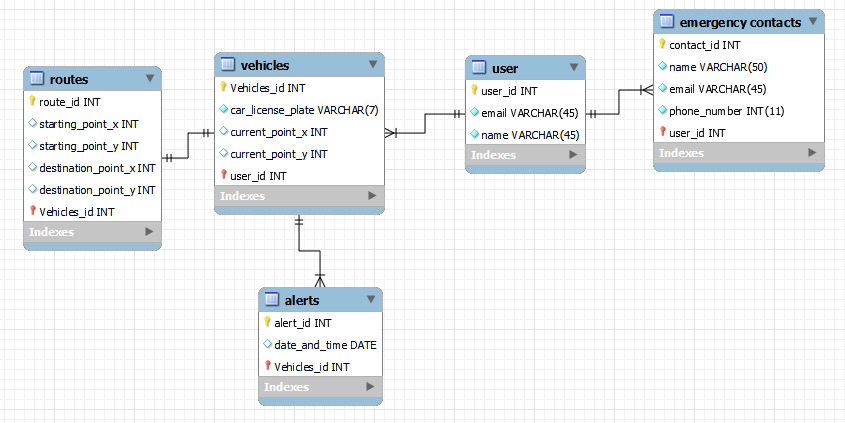

# Execução

> A fase de execução na gerência de projetos é o momento em que as atividades planejadas são realizadas. 
> Durante essa etapa, os membros da equipe executam suas tarefas de acordo com o cronograma estabelecido, os recursos são alocados conforme as necessidades e as comunicações são fundamentais para garantir que todos estejam alinhados com os objetivos. 
> O gerente de projeto atua na coordenação das atividades, resolução de problemas e na gestão de mudanças inesperadas. 
> Além disso, o monitoramento constante é essencial para garantir que o projeto esteja avançando conforme o planejado, e ajustes são feitos conforme necessário. 
> A fase de execução é o momento em que o trabalho tangível é realizado, e a eficácia nessa etapa contribui diretamente para o sucesso geral do projeto.

# Estrutura do Documento

- [Fase de Execução](#execução)
- [Interfaces do Sistema](#interfaces-do-sistema)
- [Modelagem da Solução](#modelagem-da-solução)
  - [Arquitetura da Solução](#arquitetura-da-solução)
  - [Diagrama de Classes](#diagrama-de-classes)
  - [Persistência dos Dados](#persistência-dos-dados)

# Interfaces do Sistema
[Interface do Sistema Figma](https://www.figma.com/design/dWVCaWA6MDgvu7O2hVx9Z1/Safe-Route?node-id=0-1&t=KCaM9cTf2YJUAFNu-1)

# Modelagem da Solução

> A modelagem de software envolve a criação de representações abstratas que capturam a estrutura, comportamento e interações do software a ser desenvolvido. 
> Esses modelos servem como guias visuais que auxiliam na compreensão e comunicação entre os membros da equipe de desenvolvimento. 
> A modelagem de software abrange diversas técnicas, como diagramas de classes, diagramas de sequência e diagramas de caso de uso, proporcionando uma representação visual clara das relações e funcionalidades do sistema. 
> Essa abordagem facilita a identificação precoce de requisitos e a detecção de inconsistências. 
> Além disso, a modelagem contribui para a documentação eficaz, permitindo uma compreensão mais abrangente do software antes mesmo de sua implementação. 

## Arquitetura da solução

[Arquitetura da Solução Figma](https://www.figma.com/design/rnvQbx4Xe30qiGUWhb5oo0/Arquitetura?node-id=0-1&t=27zOBLOEBiglighh-0)

## Diagrama de Classes

......  COLOQUE AQUI O SEU TEXTO E O DIAGRAMA DE CLASSES .......

> O diagrama de classes fornece uma representação visual das estruturas e relações entre as classes em um sistema orientado a objetos. 
> O diagrama serve como uma documentação visual eficaz, facilitando a compreensão, manutenção e contínua do software.
>
> **Diagrama de Classes:**
> Desenvolva um diagrama de classes para o sistema proposto.
> Caso a solução fique muito grande, divida o diagrama por módulos ou serviços.
> Explique de forma concisa o diagrama, para que seja possível entender a solução proposta.
>
> **Exemplo de diagrama de Classes**:
> 

## Persistência dos Dados

> 
